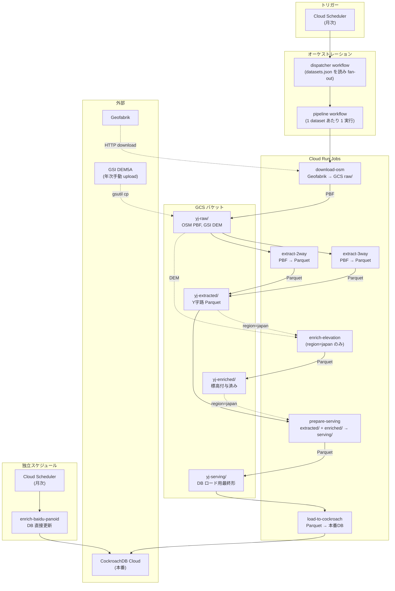

# Y字路検索サービス

OpenStreetMapデータからY字路を検出・可視化するWebアプリケーション

## 技術スタック

- **Backend**: Rust + Axum + CockroachDB + SQLx
- **Frontend**: TypeScript + React + Leaflet
- **Import**: Rust + osmpbf

## Y字路の分類システム

このシステムでは、Y字路を3つのタイプに分類します。分類は3つの分岐角度（angle_1, angle_2, angle_3）のうち、最小角度（angle_1）に基づいて行われます。

### 分類基準

| タイプ | 条件 | 説明 | UIカラー |
|--------|------|------|----------|
| **VerySharp** | angle_1 < 30° | 非常に鋭角なY字路。視認性が低く注意が必要 | <span style="color: #8B5CF6">■</span> 紫 (#8B5CF6) |
| **Sharp** | 30° ≤ angle_1 < 45° | 鋭角なY字路。やや見通しが悪い | <span style="color: #3B82F6">■</span> 明るい青 (#3B82F6) |
| **Normal** | 45° ≤ angle_1 < 60° | 標準的なY字路。比較的見通しが良い | <span style="color: #F59E0B">■</span> 琥珀色 (#F59E0B) |

### インポート時のフィルタリング

データインポート時、以下の条件でフィルタリングが行われます：

#### 1. 道路種別（highway type）によるフィルタリング

**対象となる道路種別**（以下の16種類のみ）：
- 主要道路: motorway, trunk, primary, secondary, tertiary
- 生活道路: residential, unclassified, service
- 接続路: motorway_link, trunk_link, primary_link, secondary_link, tertiary_link
- 歩行者道路: steps, pedestrian, path

**除外される道路種別**：
- footway（歩道）、cycleway（自転車道）、track（農道・林道）、bridleway（乗馬道）等
- highway tagが無い道路

**重要**: 3本の道路のうち1本でも除外対象が含まれる場合、そのY字路全体が保存されません。全ての道路が対象種別である必要があります。

#### 2. 角度によるフィルタリング

- **最小角度 < 10°** の交差点は **除外** されます
- **最小角度 ≥ 60°** の交差点は **T字路とみなして除外** されます
- これにより、**10° ≤ 最小角度 < 60°** の実際のY字路のみがデータベースに保存されます

### 分類の目的

この分類システムにより、以下が可能になります：

- **視認性の評価**: 最小角度が小さいほど見通しが悪く、注意が必要な交差点
- **データフィルタリング**: UIで特定のタイプのY字路のみを表示可能

## 環境構築

### 前提条件

- Docker & Docker Compose
- Rust (最新版)
- Node.js 18+
- CockroachDB CLI（`cockroach sql` コマンド）または psql

### セットアップ手順

#### 1. リポジトリのクローン

```bash
git clone <repository-url>
cd y-junctions
```

#### 2. データベースの起動

```bash
# CockroachDBコンテナを起動
docker-compose up -d

# データベースが起動するまで数秒待つ
sleep 5
```

起動するコンテナ：
- `y-junctions-cockroachdb`: CockroachDB（ポート26257、Web UI: http://localhost:8081）

#### 3. 環境変数の設定（メインworktree用）

```bash
# backend/.envファイルを作成
cat > backend/.env <<EOF
DATABASE_URL=postgresql://root@localhost:26257/y_junction?sslmode=disable
TEST_DATABASE_URL=postgresql://root@localhost:26257/y_junction_test?sslmode=disable
EOF
```

**注意**: 追加worktreeでは`./scripts/setup-worktree.sh`が自動で.envを作成するため、この手順は不要です。

#### 4. データベーススキーマの作成

```bash
# テスト用DBを作成
docker exec y-junctions-cockroachdb ./cockroach sql --insecure --execute "CREATE DATABASE IF NOT EXISTS y_junction_test;"

# 開発用DBにマイグレーションを実行
(cd backend && sqlx migrate run)
```

#### 5. データのインポート

**データ配置構成:**

```
~/y-junctions-data/
├── osm/
│   └── shikoku-latest.osm.pbf
└── gsi/
    └── xml/
        ├── FG-GML-*.xml
        └── ...
```

**インポートバイナリのビルド（初回のみ）**

```bash
# インポートツールをリリースモードでビルド
(cd backend && cargo build --release --bin import --bin import_two_way --bin import-elevation)
```

**PBFファイルの準備:**
- [Geofabrik](https://download.geofabrik.de/)からダウンロード
- 例: 四国データ `https://download.geofabrik.de/asia/japan/shikoku-latest.osm.pbf`
- `~/y-junctions-data/osm/` に配置

**5-1. 3-way Y字路データのインポート**

3つの異なるOSM wayが接続するY字路をインポートします。

```bash
# 四国全域の3-wayデータをインポート
(cd backend && ./target/release/import \
  --input ~/y-junctions-data/osm/shikoku-latest.osm.pbf \
  --bbox 132,33,135,35)
```

**5-2. 2-way Y字路データのインポート**

1つのwayが通過し、もう1つのwayが接続するY字路をインポートします。

```bash
# 四国全域の2-wayデータをインポート
(cd backend && ./target/release/import_two_way \
  --input ~/y-junctions-data/osm/shikoku-latest.osm.pbf \
  --bbox 132,33,135,35)
```

**注意:** 2-wayは3-wayの約4倍のデータ量になります。

**5-3. 標高データの追加**

```bash
(cd backend && ./target/release/import-elevation \
  --elevation-dir ~/y-junctions-data/gsi)
```

**標高データの準備:**
- [国土地理院 基盤地図情報](https://fgd.gsi.go.jp/download/menu.php)からダウンロード（DEM5A）
- ZIPを解凍し、XMLファイルを `~/y-junctions-data/gsi/xml/` に配置

**インポート結果の確認:**

```bash
# データ件数を確認
docker exec y-junctions-cockroachdb ./cockroach sql --insecure --database y_junction --execute "SELECT COUNT(*) FROM y_junctions;"
```

#### 6. バックエンドの起動

```bash
# サーバーバイナリをビルド（初回または変更時のみ）
(cd backend && cargo build --release --bin server)

# サーバーを起動
(cd backend && ./target/release/server)
```

バックエンドは `http://localhost:8080` で起動します。

**APIエンドポイント:**

##### GET /api/junctions - Y字路一覧取得

境界ボックス内のY字路を取得します。

**必須パラメータ:**
- `bbox` - 境界ボックス（形式: `min_lon,min_lat,max_lon,max_lat`）

**オプションパラメータ:**
- `angle_type` - 角度タイプでフィルタ（複数指定可: `verysharp`, `sharp`, `normal`）
- `min_angle_gt` - 最小角度の下限（例: `min_angle_gt=30` で angle_1 > 30°）
- `min_angle_lt` - 最小角度の上限（例: `min_angle_lt=45` で angle_1 < 45°）
- `min_angle_elevation_diff` - 最小角高低差の下限（メートル、例: `2.0`）
- `max_angle_elevation_diff` - 最小角高低差の上限（メートル、例: `5.0`）
- `limit` - 取得件数の上限（デフォルト: 1000）

**例:**
```bash
# 四国全域のY字路を取得
curl "http://localhost:8080/api/junctions?bbox=132,33,135,35"

# VerySharpとSharpタイプのみ取得
curl "http://localhost:8080/api/junctions?bbox=132,33,135,35&angle_type=verysharp&angle_type=sharp"

# 最小角度が30°未満のY字路を取得
curl "http://localhost:8080/api/junctions?bbox=132,33,135,35&min_angle_lt=30"

# 最小角高低差が2m以上のY字路を取得
curl "http://localhost:8080/api/junctions?bbox=132,33,135,35&min_angle_elevation_diff=2"

# 最小角高低差が2m〜5mのY字路を取得
curl "http://localhost:8080/api/junctions?bbox=132,33,135,35&min_angle_elevation_diff=2&max_angle_elevation_diff=5"
```

**レスポンス:**
```json
{
  "type": "FeatureCollection",
  "total_count": 1234,
  "features": [
    {
      "type": "Feature",
      "geometry": {
        "type": "Point",
        "coordinates": [133.5, 34.0]
      },
      "properties": {
        "id": 1,
        "osm_node_id": 123456789,
        "angles": [35, 145, 180],
        "angle_type": "sharp",
        "elevation": 245.5,
        "min_elevation_diff": 12.3,
        "max_elevation_diff": 18.7,
        "min_angle_elevation_diff": 15.2,
        "streetview_url": "https://www.google.com/maps/@?api=1&map_action=pano&viewpoint=34.0,133.5"
      }
    }
  ]
}
```

##### GET /api/junctions/:id - 特定のY字路取得

ID指定でY字路の詳細を取得します。

**例:**
```bash
curl "http://localhost:8080/api/junctions/1"
```

##### GET /api/stats - 統計情報取得

データベース全体の統計情報を取得します。

**例:**
```bash
curl "http://localhost:8080/api/stats"
```

**レスポンス:**
```json
{
  "total_count": 1234,
  "by_type": {
    "verysharp": 123,
    "sharp": 456,
    "normal": 567
  }
}
```

#### 7. フロントエンドの起動

```bash
# 別のターミナルで実行
cd frontend
npm install  # 初回のみ
npm run dev
```

フロントエンドは `http://localhost:3000` で起動します（ポートは `frontend/vite.config.ts` で指定）。

### Git Worktree Runnerの設定（追加worktree用）

初回セットアップ完了後、以下の設定を行うことで、追加worktree作成時の手間を自動化できます。

```bash
# worktree作成時の自動セットアップを有効化
git gtr config add gtr.hook.postCreate "npm install"
git gtr config add gtr.hook.postCreate "cd frontend && npm install"
git gtr config add gtr.hook.postCreate "mise trust"
git gtr config add gtr.hook.postCreate "./scripts/setup-worktree.sh"

# 設定確認
git config --get-all gtr.hook.postCreate
```

この設定により、`git gtr new <branch>` で新しいworktreeを作成すると、自動的に以下が実行されます：
- 必要な依存関係のインストール
- mise設定ファイルの自動trust
- **データベース設定（backend/.env）の自動作成**（共有DBを使用、インポート不要）

## Worktree運用

**前提**: 上記の初回セットアップとGit Worktree Runner設定が完了していること。

### 新しいworktree作成

```bash
git gtr new feature/xxx
cd ../y-junctions-feature-xxx
(cd backend && cargo test)  # すぐテスト可能
```

### スキーマ変更時（稀）

```bash
# 専用DB作成
docker exec y-junctions-cockroachdb ./cockroach sql --insecure \
  --execute "CREATE DATABASE my_feature_db;"

# .env書き換えとマイグレーション実行
cat > backend/.env <<EOF
DATABASE_URL=postgresql://root@localhost:26257/my_feature_db?sslmode=disable
TEST_DATABASE_URL=postgresql://root@localhost:26257/y_junction_test?sslmode=disable
EOF
(cd backend && sqlx migrate run)
```

## 開発

### バックエンドのテスト

```bash
(cd backend && cargo test)
```

### フロントエンドのテスト

```bash
cd frontend
npm run typecheck
npm run lint
```

### コード品質評価（SonarQube Cloud）

リポジトリ全体（backend + frontend）の品質を [SonarQube Cloud](https://sonarcloud.io/dashboard?id=cozy-corner_y-junctions)
で評価する。**CI では回さず、見たいときに main からローカル実行する。**

SonarQube Cloud 側の **Automatic Analysis は OFF** にしてある。そのため PR に Sonar のチェックは付かない。
理由と設定の経緯は [doc/sonarqube-cloud.md](doc/sonarqube-cloud.md) を参照。

#### 準備

```bash
brew install sonar-scanner
cargo install cargo-llvm-cov --locked

# token は SonarQube Cloud の My Account > Security で発行し .env に置く（.gitignore 済み）
echo 'SONAR_TOKEN=xxx' >> .env
```

Rust の toolchain は `.mise.toml` で固定してあるので `mise install` だけでよい。

#### 実行

DB を起動した状態で（`docker-compose up -d`）、リポジトリルートで実行する。

```bash
mise run sonar
```

`SONAR_TOKEN` は `.mise.toml` の `[env] _.file = ".env"` により `.env` から自動で読まれる。

`sonar` タスクが backend / frontend のカバレッジ生成を済ませてから `sonar-scanner` を呼ぶ。
カバレッジだけ作りたい場合は `mise run sonar:coverage:backend` / `sonar:coverage:frontend` を個別に叩く。
解析の設定は `sonar-project.properties` から読まれる。

解析結果はローカルには残らず、SonarQube Cloud 上のプロジェクトの状態を**上書き**する。
またスキャナは git の状態ではなくファイルシステムを見るため、未コミットの変更もそのまま解析される。
クリーンな作業ツリーで実行すること。

### データベースの接続

```bash
# CockroachDB CLIでデータベースに接続
docker exec -it y-junctions-cockroachdb ./cockroach sql --insecure --database y_junction
```

### テーブル構造の確認

```sql
-- テーブル定義を表示
\d y_junctions

-- データのサンプル表示
SELECT id, osm_node_id, angle_1, angle_2, angle_3,
       ST_AsText(location) as location
FROM y_junctions
LIMIT 10;
```

## トラブルシューティング

### ポート5432が使用中

```bash
# 既存のPostgreSQLコンテナを停止
docker ps | grep postgres
docker stop <container-id>
```

### データベース接続エラー

```bash
# データベースコンテナの状態確認
docker ps
docker logs y-junctions-cockroachdb

# 環境変数の確認
cat backend/.env
```

### インポートが失敗する

```bash
# backend/.envファイルが存在するか確認
ls -la backend/.env

# データベースが起動しているか確認
docker exec y-junctions-cockroachdb ./cockroach sql --insecure --execute "SELECT 1;"
```

## プロジェクト構成

```
.
├── backend/               # Rustバックエンド
│   ├── src/
│   │   ├── main.rs       # APIサーバー
│   │   ├── bin/
│   │   │   └── import.rs # データインポートツール
│   │   ├── api/          # APIハンドラー
│   │   ├── db/           # データベースリポジトリ
│   │   ├── domain/       # ドメインモデル
│   │   └── importer/     # PBFパーサー
│   ├── migrations/       # DBマイグレーション
│   └── Cargo.toml
├── frontend/             # Reactフロントエンド
│   ├── src/
│   │   ├── components/   # UIコンポーネント
│   │   ├── api/          # APIクライアント
│   │   └── hooks/        # カスタムフック
│   └── package.json
└── docker-compose.yml    # CockroachDB設定
```

## データパイプライン（GCP）

OSM データの取得から本番 DB への投入までを Cloud Run Jobs + Cloud Workflows で自動化しています。
Cloud Scheduler が月次で dispatcher を起動し、`pipeline/datasets.json` に定義された各データセットを並列処理します。



**補足:**
- `enrich-elevation` は region switch パターンで `region=japan` の dataset でのみ実行される（それ以外はスキップ）
- `enrich-baidu-panoid` は Workflow 非統合で Cloud Scheduler から直接トリガ（中国リージョン専用）
- GSI DEM は規約上自動取得不可。年次に `gsutil cp` で `yj-raw/dem/{YYYYMMDD}/` に手動アップロード

## 本番環境デプロイ

### インフラ管理

Terraform（`terraform/`ディレクトリ）で管理。Terraform Cloudでstate管理。

#### Terraform Cloud認証（マシン単位で1回のみ）

```bash
terraform login
# ブラウザでログインしてトークンを取得
# ~/.terraform.d/credentials.tfrc.json に保存される
```

#### git worktreeでの準備（worktree作成時に毎回）

```bash
# 1. mainブランチのworktreeから terraform.tfvars をコピー
# <main-worktree-path> は実際のmainブランチのworktreeパスに置き換えてください
cp <main-worktree-path>/terraform/terraform.tfvars terraform/

# 2. Terraform初期化
cd terraform
terraform init
```

**注意:** `terraform.tfvars` には機密情報（Neon API key）が含まれるため、gitignoreで除外されています。

#### Terraform実行

```bash
cd terraform
terraform plan    # 変更内容を確認
terraform apply   # 変更を適用
```

**注意:** アプリケーションのデプロイ（backend/frontend）はmainブランチへのpush時にGitHub Actionsで自動実行されますが、Terraformの変更は手動で`terraform apply`を実行する必要があります。

### データインポート（本番環境）

本番DBのデータをローカルに取り込むには `/sync-from-prod` スキルを使用してください。

ローカルDBの全データを本番DBに反映するには `/deploy-data` スキルを使用してください。

新規地域のデータを追加して本番に反映するには `/add-region` スキルを使用してください。

### DEM データ更新（年次運用、Cloud Run Jobs パイプライン）

`enrich-elevation` Cloud Run Job は `gs://${PROJECT_ID}-yj-raw/dem/{YYYYMMDD}/` 配下の GSI DEM XML を読み込んで Y 字路に標高を付与する。DEM5A は GSI 規約上自動取得不可のため、operator が年次で手動アップロードする：

```bash
# 1. 国土地理院から DEM5A を入手し ~/y-junctions-data/gsi/xml/ に展開（既存と同様）

# 2. gzip で圧縮（~10:1 縮小、yj-raw Coldline と合わせて月額 $0.17 程度）。
# -k で元の .xml を残す：upload リトライ時の再取得回避 + ローカルの
# import-elevation CLI が引き続き同じディレクトリを使えるように。
gzip -k ~/y-junctions-data/gsi/xml/*.xml

# 3. 日付 prefix にアップロード（YYYYMMDD、enrich-elevation Job が辞書順
# 最大の YYYYMMDD subdir を採用）
gsutil cp ~/y-junctions-data/gsi/xml/*.xml.gz \
  gs://${PROJECT_ID}-yj-raw/dem/$(date +%Y%m%d)/

# 4. 月次パイプライン自走を待つか、refresh したい時は手動キック。
# 引数は pipeline/datasets.json の該当 entry をコピペすればよい：
gcloud workflows execute yj-pipeline \
  --location=asia-northeast1 \
  --data='{"dataset":"shikoku-latest","geofabrik_url":"https://download.geofabrik.de/asia/japan/shikoku-latest.osm.pbf","bbox":"134.0,34.3,134.1,34.4","region":"japan"}'
```

DEM は `dem/` prefix が lifecycle 自動削除の対象外（terraform/pipeline.tf
で `matches_prefix = ["osm/"]` 設定）。**古い DEM 日付 prefix の掃除は
operator が新 DEM upload 時に手動で行う：**
```bash
gsutil -m rm -r gs://${PROJECT_ID}-yj-raw/dem/20250515/  # 一年前の DEM 例
```

## ブランチ命名規則

PRのマージ時にGitHub Releasesのドラフトが自動生成されます。ブランチ名によって自動的にラベルが付与されます：

- `data/*` - データ追加・更新 → `data` ラベル
- `feature/*` - 新機能 → `feature` ラベル
- `fix/*` または `bugfix/*` - バグ修正 → `bug` ラベル
- `refactor/*`, `chore/*`, `perf/*`, `style/*`, `docs/*` - 内部改善・ドキュメント → `internal` ラベル（リリースノートに含まれない）
- `dependabot/*` または dependabot作成のPR - 依存関係の自動更新 → `internal` ラベル（リリースノートに含まれない）

## ライセンス

MIT
